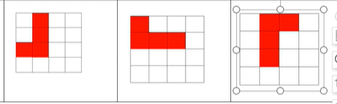

## 方块设计

### 类型

      分别有 L、J、Z、S、T、O 的方块对应如下

### L 方块

### J 方块

#### 对应数据
    [0, 1, 0, 0]     [1, 0, 0, 0]     [0, 1, 1, 0]     [1, 1, 1, 0]
    [0, 1, 0, 0]     [1, 1, 1, 0]     [0, 1, 0, 0]     [0, 0, 1, 0]
    [1, 1, 0, 0]     [0, 0, 0, 0]     [0, 1, 0, 0]     [0, 0, 0, 0]
    [0, 0, 0, 0]     [0, 0, 0, 0]     [0, 0, 0, 0]     [0, 0, 0, 0]

### Z 方块

### S 方块

### T 方块

### O 方块

